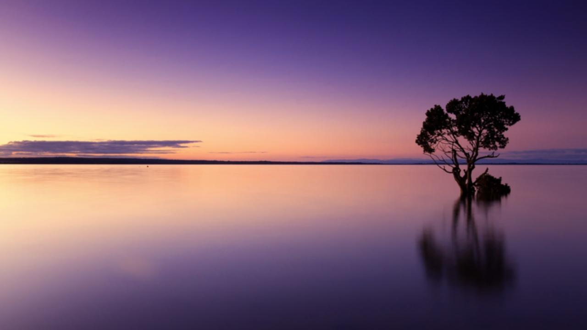
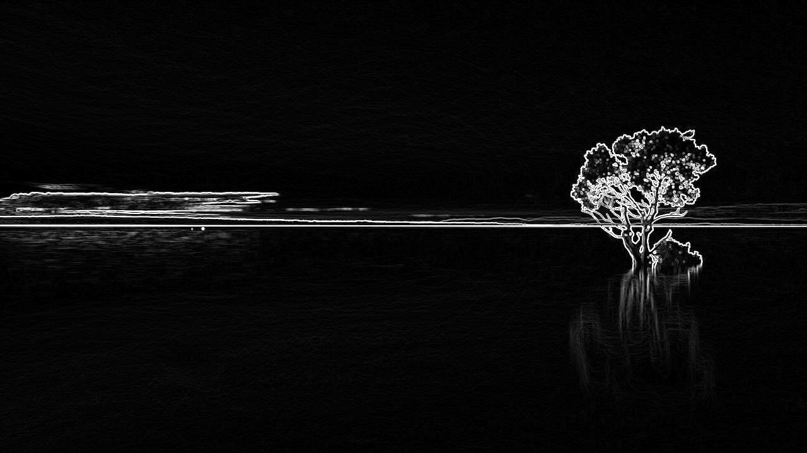
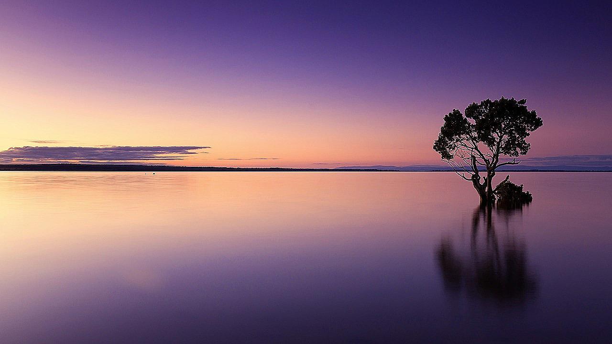
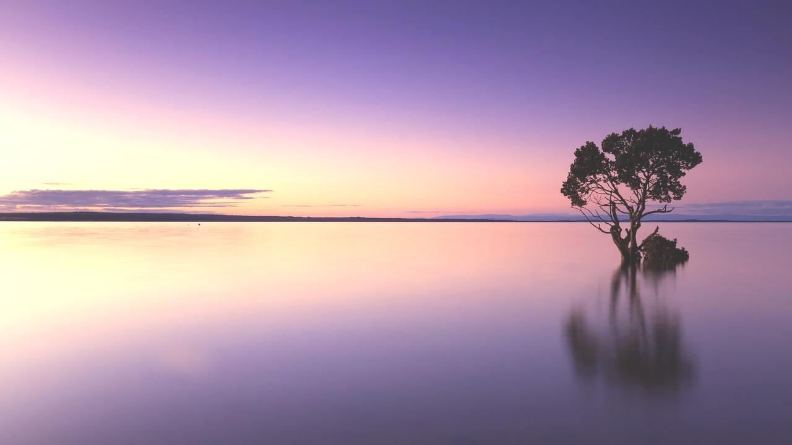
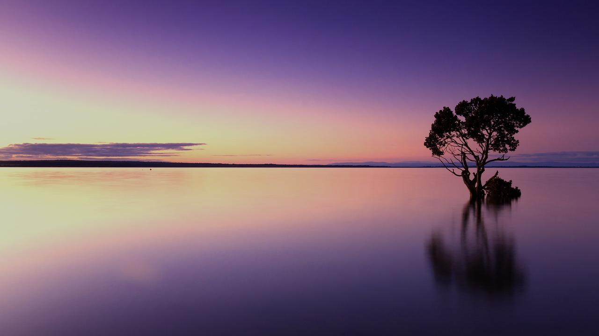
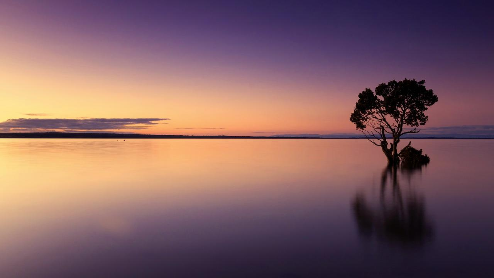
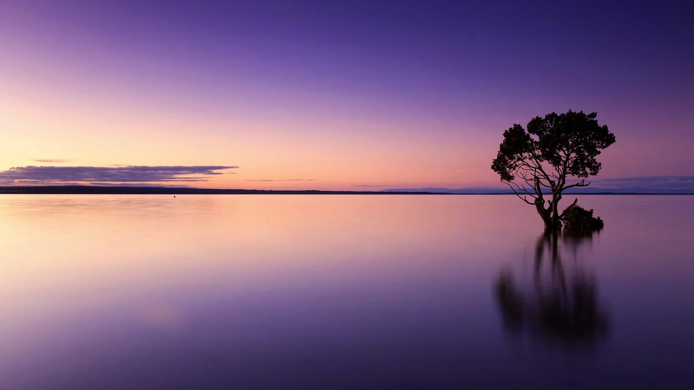
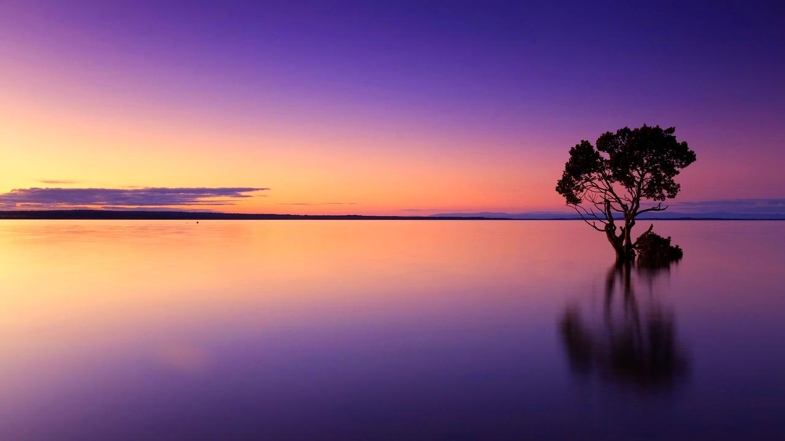
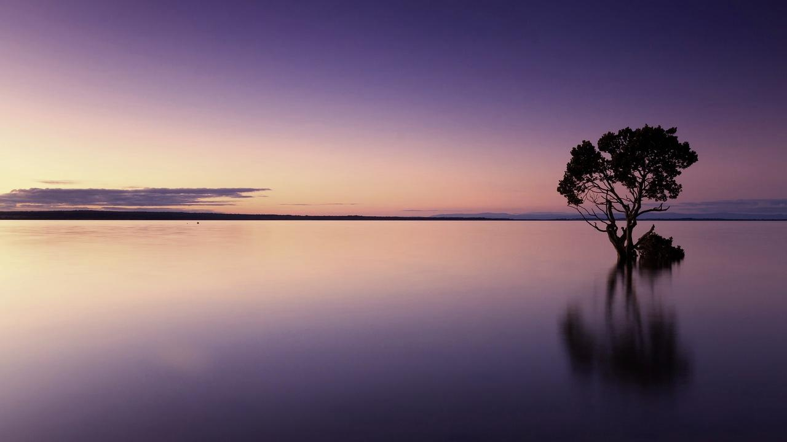

# Advanced Image Editing CLI Tool

## Introduction

In this project, an Advanced Image Editing CLI Tool, allows users to apply various filters and adjustments to images through a simple command-line interface. This tool is designed to demonstrate efficient, elegant, and extendable coding practices.

This CLI tool makes use of convolution operations to apply effects such as blurring, sharpening, and edge detection, providing users with powerful capabilities to enhance and manipulate their images.

## Features

- **Multiple Filters**: Apply different filters to enhance your images:
  - **Box Blur**: Softens the image.
    <br>
    
  
  - **Sobel Edge Detection**: Highlights significant edges in the image, useful for object segmentation.
    <br>
    

  - **Sharpen**: Amplifies image details to make them more pronounced.
    <br>
    

    
- **Image Adjustments**: Adjust brightness, contrast, and saturation to fine-tune the visual aspects. Here are some results achieved with these adjustments:

  - **Brightness Adjustment**:
    <br>
    
    

  - **Contrast Adjustment**:
    <br>
    
    

  - **Saturation Adjustment**:
    <br>
    
    

- **Layering**: Apply multiple filters and adjustments in sequence.
- **Output Options**: Directly display the edited image or save it to a designated path.

## Installation

To install the Advanced Image Editing CLI Tool, follow these steps:

1. Clone the repository:
   ```
   git clone https://github.com/yourusername/image-editing-cli-tool.git
   ```
2. Navigate to the project directory:
   ```
   cd image-editing-cli-tool
   ```
3. Install the required dependencies:
   ```
   pip install -r requirements.txt
   ```

## Usage
Before using the tool, ensure the PYTHONPATH environment variable is set to include the path to the source directory:
```
export PYTHONPATH=$(pwd)/source
```
Then, use the tool by running the following command from the command line:

```
python image_editor.py --image <path-to-image> [--filter <filter-name> --strength <value>] [--adjust <adjustment-name> <value>]...
```

### Examples

- Apply a blur filter with strength 5:
  ```
  python image_editor.py --image input/image_to_filter.jpg --filter blur --strength 5
  ```
- Adjust brightness by 20 units:
  ```
  python image_editor.py --image input/image.jpg --adjust brightness 20
  ```

## API Reference

The tool supports the following commands:

- **`--image <path>`**: Specifies the path to the image file.
- **`--filter <filter-name> --strength <value>`**: Applies a specified filter with an optional strength value.
- **`--adjust <adjustment-name> <value>`**: Performs color and image adjustments.
- **`--output <path>`**: Specifies the path to save the edited image, or/and to display the edited image directly.

adjust values:
  - **`brightness <value>`**: Adjusts the brightness of the image. Positive values increase brightness, and negative values decrease brightness. If the value is out of the range [0, 255], it will be clipped to the nearest valid value.
  - **`contrast <value>`**: Adjusts the contrast of the image. A value of 1.0 means no change, while greater than 1.0 increases contrast and less than 1.0 but greater than 0 decreases contrast.
  - **`saturation <value>`**: Adjusts the saturation of the image. A value of 1.0 means no change, values greater than 1.0 enhance saturation, and values between 0 and 1.0 reduce saturation.
