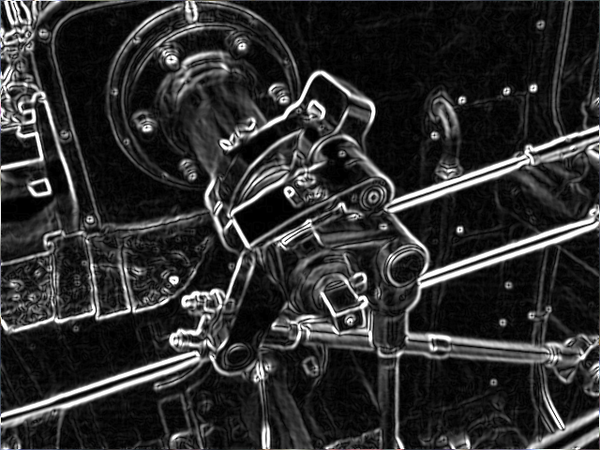

# Advanced Image Editing CLI Tool

## Introduction

In this project, an Advanced Image Editing CLI Tool, allows users to apply various filters and adjustments to images through a simple command-line interface. This tool is designed to demonstrate efficient, elegant, and extendable coding practices.

This CLI tool makes use of convolution operations to apply effects such as blurring, sharpening, and edge detection, providing users with powerful capabilities to enhance and manipulate their images.

## Features

- **Multiple Filters**: Apply different filters including:
  - **Box Blur**: Softens the image.
    - 
  - **Sobel Edge Detection**: Highlights edges, useful for object segmentation.
    - 
  - **Sharpen**: Enhances image details to make them more defined.
    - 


- **Image Adjustments**: Adjust brightness, contrast, and saturation to fine-tune the visual aspects.
- **Layering**: Apply multiple filters and adjustments in sequence.
- **Output Options**: Directly display the edited image or save it to a designated path.

## Installation

To install the Advanced Image Editing CLI Tool, follow these steps:

1. Clone the repository:
   ```
   git clone https://github.com/yourusername/image-editing-cli-tool.git
   ```
2. Navigate to the project directory:
   ```
   cd image-editing-cli-tool
   ```
3. Install the required dependencies:
   ```
   pip install -r requirements.txt
   ```

## Usage

To use the tool, run the following command from the command line:

```
python edit_image --image <path-to-image> [--filter <filter-name> --strength <value>] [--adjust <adjustment-name> <value>]...
```

### Examples

- Apply a blur filter with strength 5:
  ```
  python edit_image --image path/to/image.jpg --filter blur --strength 5
  ```
- Adjust brightness by 20 units:
  ```
  python edit_image --image path/to/image.jpg --adjust brightness 20
  ```

## API Reference

The tool supports the following commands:

- **`--image <path>`**: Specifies the path to the image file.
- **`--filter <filter-name> --strength <value>`**: Applies a specified filter with an optional strength value.
- **`--adjust <adjustment-name> <value>`**: Performs color and image adjustments.